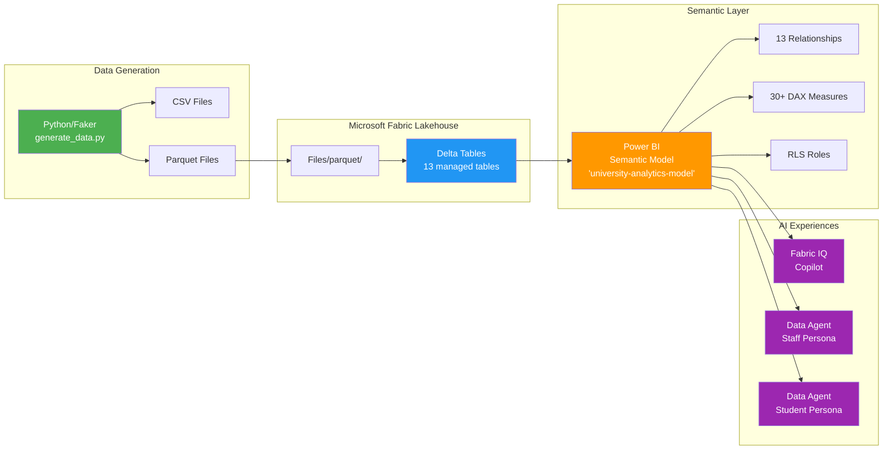
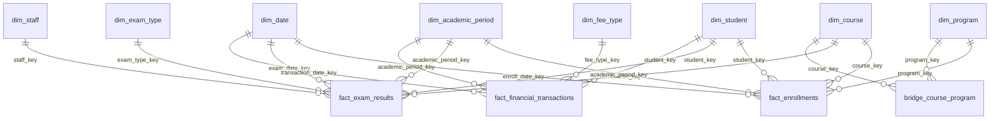

# Architecture Diagram — Fabric IQ Education Demo

## High-Level Architecture



## Data Flow

```
┌──────────────────────────────────────────────────────────────────────┐
│                        DATA GENERATION                               │
│                                                                      │
│  Python + Faker ──► 13 Tables (CSV + Parquet)                       │
│  (Local or Notebook 01)                                              │
└──────────────────────┬───────────────────────────────────────────────┘
                       │
                       ▼
┌──────────────────────────────────────────────────────────────────────┐
│                     FABRIC LAKEHOUSE                                 │
│                                                                      │
│  Files/parquet/  ──► Notebook 02 ──► Delta Tables (university.*)    │
│                      (explicit schemas,    (OPTIMIZE + ZORDER)       │
│                       DQ assertions)                                 │
└──────────────────────┬───────────────────────────────────────────────┘
                       │
                       ▼
┌──────────────────────────────────────────────────────────────────────┐
│                    SEMANTIC MODEL                                    │
│                                                                      │
│  university-analytics-model (Power BI on Fabric)                    │
│  ├── 13 Relationships (M:1, star schema)                            │
│  ├── 30+ DAX Measures (4 folders)                                   │
│  ├── 4 Hierarchies                                                   │
│  └── RLS: Staff (full) / Student (email filter)                     │
└──────────┬──────────────────┬────────────────────┬───────────────────┘
           │                  │                    │
           ▼                  ▼                    ▼
┌─────────────────┐ ┌─────────────────┐ ┌─────────────────────┐
│  Fabric IQ      │ │  Data Agent     │ │  Data Agent          │
│  Copilot        │ │  Staff Persona  │ │  Student Persona     │
│                 │ │                 │ │                       │
│  4 demo scenes  │ │  10 NL queries  │ │  10 NL queries       │
│  Ad-hoc Q&A     │ │  Full access    │ │  RLS-scoped          │
└─────────────────┘ └─────────────────┘ └─────────────────────┘
```

## Star Schema — Entity Relationship Diagram



## Star Schema — ASCII View

```
                            ┌──────────────┐
                            │  dim_date    │
                            │  (calendar)  │
                            └──────┬───────┘
                                   │
        ┌──────────────┐    ┌──────┴───────┐    ┌──────────────────┐
        │  dim_staff   │    │              │    │  dim_exam_type   │
        │              ├────┤  fact_exam   ├────┤                  │
        └──────┬───────┘    │  _results    │    └──────────────────┘
               │            │              │
               │            └──────┬───────┘
               │                   │
┌──────────────┴──┐         ┌──────┴───────┐    ┌──────────────────┐
│  dim_department │         │  dim_student ├────┤  dim_program     │
│                 │         │              │    │                  │
└────────┬────────┘         └──┬───────┬───┘    └────────┬─────────┘
         │                     │       │                 │
         │              ┌──────┴──┐ ┌──┴────────────┐    │
┌────────┴────────┐     │  fact_  │ │  fact_         │    │
│  dim_course     ├─────┤  enrol- │ │  financial_   │    │
│                 │     │  ments  │ │  transactions │    │
└────────┬────────┘     └─────────┘ └───────┬───────┘    │
         │                                  │            │
         │              ┌───────────────────┘            │
         │              │                                │
    ┌────┴──────────┐   │    ┌──────────────────┐       │
    │ bridge_course │   │    │  dim_fee_type    │       │
    │ _program      │   │    │                  │       │
    └───────────────┘   │    └──────────────────┘       │
                        │                                │
                  ┌─────┴──────────────┐                │
                  │ dim_academic_period │                │
                  │                    │                │
                  └────────────────────┘                │
```

## Notebook Pipeline

```
┌─────────────────────────────────────────────────────────────────┐
│                      NOTEBOOK PIPELINE                          │
│                                                                  │
│  ┌──────────┐   ┌──────────┐   ┌──────────┐                    │
│  │ NB 01    │──►│ NB 02    │──►│ NB 03    │                    │
│  │ Generate  │   │ Delta    │   │ Semantic │                    │
│  │ & Ingest │   │ Tables   │   │ Model    │                    │
│  └──────────┘   └──────────┘   └─────┬────┘                    │
│                                      │                          │
│                          ┌───────────┼───────────┐              │
│                          ▼           ▼           ▼              │
│                    ┌──────────┐ ┌──────────┐ ┌──────────┐      │
│                    │ NB 04    │ │ NB 05    │ │ NB 06    │      │
│                    │ Copilot  │ │ Staff    │ │ Student  │      │
│                    │ Demo     │ │ Agent    │ │ Agent    │      │
│                    └──────────┘ └──────────┘ └──────────┘      │
│                                                                  │
│  Sequential: 01 → 02 → 03 (must run in order)                  │
│  Parallel:   04, 05, 06 (can demo independently)               │
└─────────────────────────────────────────────────────────────────┘
```

## Technology Stack

| Layer | Technology | Purpose |
|-------|-----------|---------|
| Data Generation | Python, Faker, NumPy, SciPy | Synthetic university data |
| Storage | Fabric Lakehouse, Delta Lake | ACID-compliant data store |
| Compute | PySpark (Fabric Runtime 1.3) | Data processing & transformation |
| Semantic | Power BI Semantic Model | Business logic, measures, security |
| AI — Copilot | Fabric IQ Copilot (Azure OpenAI) | Ad-hoc natural language insights |
| AI — Agents | Fabric Data Agents | Role-based conversational analytics |
| Security | Row-Level Security (RLS) | Student data isolation |
